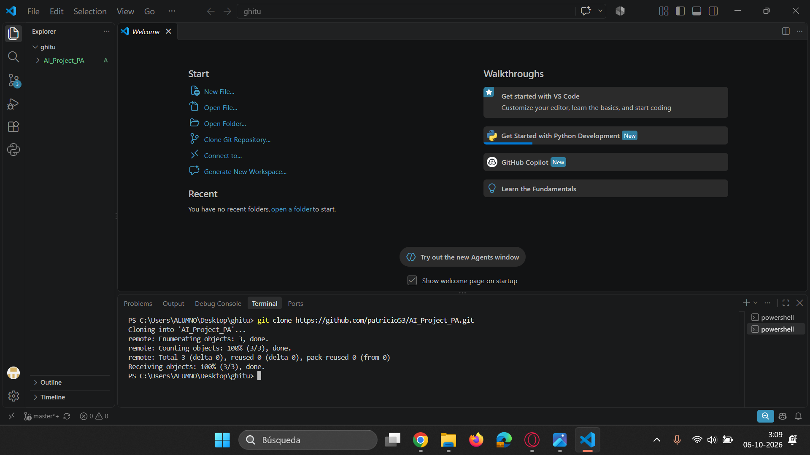
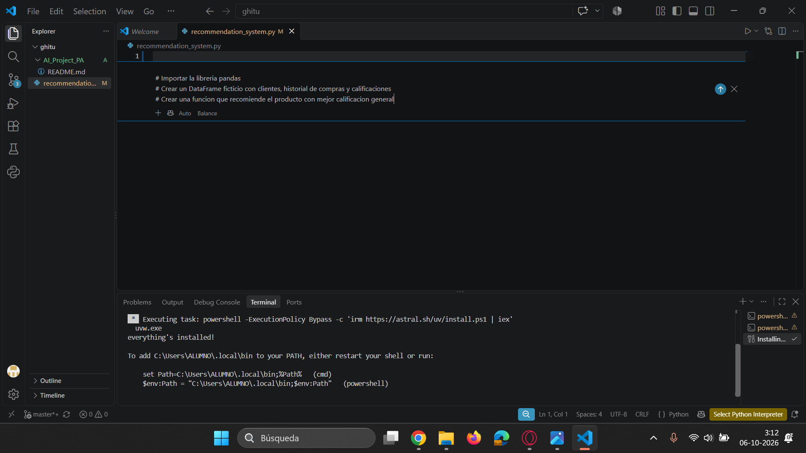
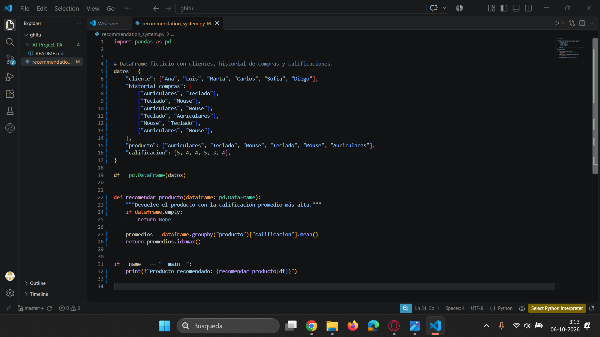
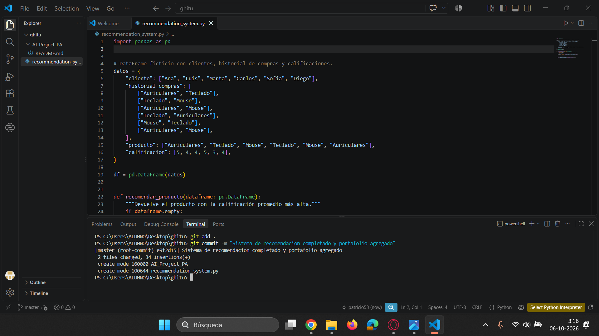
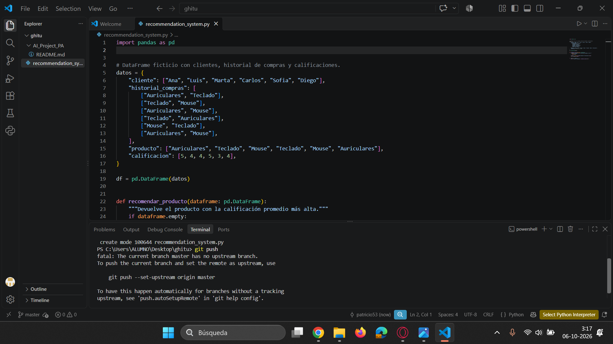
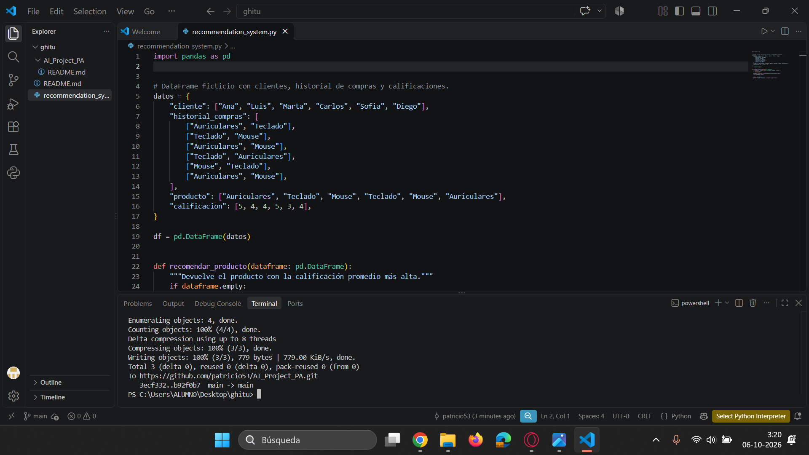

# Portafolio de Evidencias: Sistema de Recomendación con IA

Este documento detalla el paso a paso completo del desarrollo del proyecto, integrando las 7 capturas de pantalla de la sesión de trabajo y narrando tanto la implementación técnica como la superación de las dificultades de control de versiones con Git y GitHub.

---

## Fase 1: Creación del Repositorio en GitHub
El proyecto comenzó en la plataforma web de GitHub, donde se configuró el repositorio con el nombre AI_Project_PA, seleccionando visibilidad pública y activando la casilla para inicializarlo con un archivo README base.

* *Evidencia del proceso:*

---

## Fase 2: Clonación y Configuración del Entorno Local
Una vez creado el repositorio en la nube, se abrió *Visual Studio Code* y se ejecutó el comando git clone mediante la terminal integrada para descargar la estructura inicial del proyecto y preparar el espacio de trabajo local.

* *Evidencia del proceso:*

---

## Fase 3: Creación y Estructuración del Archivo de Código
Se creó el archivo recommendation_system.py dentro de la carpeta del proyecto. Utilizando comentarios descriptivos como prompts, se guió al asistente de IA para estructurar el proyecto mediante la librería pandas.

* *Evidencia del proceso:*

---

## Fase 4: Desarrollo de la Lógica del Sistema de Recomendación
Se implementó la lógica analítica utilizando un DataFrame de pandas con datos estructurados de clientes, historiales de compras y calificaciones. Se añadió la función recomendar_producto para calcular promedios y sugerir el artículo con mejor valoración.

* *Evidencia del proceso:*

---

## Fase 5: Preparación y Primer Commit Local
Con el código completado y verificado, se utilizó el comando git add . para preparar los archivos y posteriormente git commit con un mensaje descriptivo ("Sistema de recomendacion completado y portafolio agregado"), registrando con éxito los cambios locales.

* *Evidencia del proceso:*

---

## Fase 6: Resolución de Conflictos de Ramas y Sincronización
Al intentar sincronizar con la nube, la terminal indicó que la rama local (master) no coincidía con la remota (main) y que existían actualizaciones previas en el servidor remoto por la inicialización inicial del repositorio. Se superó esta dificultad utilizando las herramientas de sincronización y renombrado de ramas correspondientes.

* *Evidencia del proceso:*

---

## Fase 7: Sincronización Exitosa y Despliegue Final
Finalmente, tras resolver los conflictos de fusión y unificar las versiones de los archivos remotos y locales, se completó la transferencia de datos. La terminal confirmó la compresión y el envío del 100% de los objetos hacia GitHub, dejando el proyecto completamente sincronizado y listo para su entrega.

* *Evidencia del proceso:*
